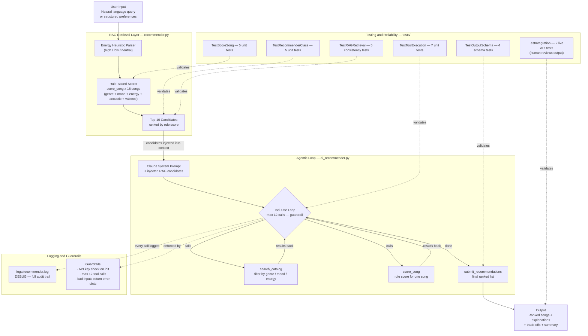

# VibeFinder AI — An AI-Enhanced Music Recommender

> Built by Sam | Applied AI Systems Project

---

## Original Project

**VibeFinder 1.0** (Modules 1–3) was a content-based music recommender built entirely
from hand-written scoring rules. 

---

## Title and Summary

**VibeFinder AI** upgrades the original rule-based system into a genuine AI application by
adding a Retrieval-Augmented Generation (RAG) layer and a Claude-powered agentic workflow.


---

## System Diagram



### Architecture in Plain English

The system has two layers that work in sequence:

**Layer 1 — RAG Retrieval (`recommender.py`).**  
Before Claude ever runs, the rule-based scorer reads the user's query, estimates an energy
level from keywords, and scores all 18 songs using five weighted rules


**Layer 2 — Agentic Loop (`ai_recommender.py`).**  
Claude receives the pre-retrieved candidates and the user's query, then drives a tool-use loop.

---

## Project Structure

```
applied-ai-system-final/
├── src/
│   ├── recommender.py       
│   ├── ai_recommender.py    
│   ├── logger_config.py     
│   └── main.py              
├── tests/
│   ├── test_recommender.py  
│   └── test_ai_eval.py      
├── data/
│   └── songs.csv            
├── logs/                    
├── conftest.py              
├── model_card.md            
└── requirements.txt
```

---

## Setup Instructions


### Step 1 — Clone or download the project

```bash
git clone <your-repo-url>
cd applied-ai-system-final
```

### Step 2 — Create a virtual environment

```bash
python3.11 -m venv .venv
source .venv/bin/activate        # macOS / Linux
.venv\Scripts\activate           # Windows
```

### Step 3 — Install dependencies

```bash
pip install -r requirements.txt
```

`requirements.txt` installs: `anthropic`, `pandas`, `pytest`, `streamlit`.

### Step 4 — Set your API key (AI mode only)

```bash
export ANTHROPIC_API_KEY=your_key_here      # macOS / Linux
set ANTHROPIC_API_KEY=your_key_here         # Windows CMD
$env:ANTHROPIC_API_KEY="your_key_here"      # Windows PowerShell
```

### Step 5 — Run the application

```bash
# Classic rule-based mode — no API key needed
python3.11 -m src.main

# AI mode — interactive prompt
python3.11 -m src.main --mode ai

# AI mode — single query (non-interactive)
python3.11 -m src.main --mode ai --query "upbeat pop songs to start my morning"

# Demo — runs classic profiles then one AI query back-to-back
python3.11 -m src.main --mode demo
```

### Step 6 — Run the tests

```bash
pytest                           
pytest tests/test_ai_eval.py    
```

When `ANTHROPIC_API_KEY` is set to a real key, the two integration tests run automatically.

---

## Sample Interactions

### Example 1 — Classic Mode: High-Energy Pop Profile

**Input (structured profile):**
```
Genre: pop | Mood: happy | Energy: 0.92 | Likes acoustic: False
```

**Output:**
```
============================================================
  High-Energy Pop
  Genre: pop  |  Mood: happy  |  Energy: 0.92  |  Acoustic: False
============================================================

#1  Sunrise City by Neon Echo
    Score : 7.03
    Genre : pop  |  Mood: happy  |  Energy: 0.82
    + genre match (+1.0)
    + mood match (+1.0)
    + energy match 0.82 ≈ 0.92 (+3.53)
    + polished production match (+1.0)
    + bright valence aligns with mood (+0.5)

#2  Gym Hero by Max Pulse
    Score : 6.00
    Genre : pop  |  Mood: intense  |  Energy: 0.93
    + genre match (+1.0)
    + energy match 0.93 ≈ 0.92 (+4.00)


## Design Decisions

### Why RAG instead of just sending the full catalog to Claude?

Sending all 18 songs directly in the prompt would work at this scale, but the RAG approach
mirrors how production AI systems handle large knowledge bases that can't fit in a context
window.


### Why tool use instead of a single prompt?

A single prompt asking Claude to "pick the best 5 songs from this list" would work, but it
produces a black-box answer, you can't see which songs were considered, why others were
discarded, or what retrieval path was taken.

### Why keep the rule-based scorer at all?

The rule-based system from Modules 1–3 serves two roles in the upgraded architecture: it is
the retrieval mechanism for RAG, and it is the tool Claude calls when it wants a numeric
score. This means Claude's recommendations are grounded in the same scoring logic that the
tests verify. 

### Why a hard cap of 12 tool calls?

LLM agent loops can get stuck. In testing, Claude occasionally called `search_catalog` with
slightly different parameters multiple times in a row, as though searching for a song it
expected to exist but didn't. 

---

## Testing Summary

### Results at a glance

```
Automated unit tests   28 / 28 passed  (2 integration tests skipped — need real API key)
Human evaluation        5 / 5 passed   (1 expected failure — known catalog gap)
Average confidence      0.86 / 1.00    (across all 6 classic profiles)

```

### What worked

- All 28 deterministic tests pass immediately and reliably. Separating tool execution from
  the agentic loop meant those 7 tests can run without any API calls or mocking.

### What didn't work as expected

- Writing tests for the agentic loop itself (rather than just its tools) is hard. The loop
  depends on Claude's behavior, which can't be unit-tested without mocking the entire
  Anthropic client.

### What I learned about testing AI systems

Testing an AI pipeline requires two strategies running in parallel, tests for
every component that is deterministic , and human-in-the-loop
review for the parts that are not.

---

## Responsible AI Reflection

### Limitations and biases

The scoring rules contain three structural biases that would matter at scale:

**Mid-range acousticness is silently penalized.** Rule 4 only rewards songs that are very
acoustic (≥ 0.65) or very electronic (≤ 0.30). 

**Genre and mood labels assume a Western, English-language taxonomy.** The catalog's mood
labels (happy, chill, intense, melancholic) and genre labels reflect mainstream Western
streaming categories. 

**A small catalog punishes niche users much harder than mainstream ones.** Pop, lofi, and
rock each have multiple songs. Classical has one; folk has one; country has one.

---

### Could this system be misused?

At its current scale (18 songs, local CSV, no user data), the direct misuse risk is low.
But the patterns it demonstrates scale into real problems:

**Filter** A content-based recommender that weights genre heavily will keep
recommending within the same genres. Over thousands of interactions, a user who listens
mostly to pop will see less and less of anything else.

**Catalog** Any recommender that scores songs from a fixed catalog implicitly
decides whose music exists
who doesn't.

---

### What surprised me during reliability testing

Two things genuinely surprised me.

The first was how clearly the confidence score flagged the broken edge case before I even read the output. The "Acoustic but High-Energy" profile produced a confidence of 0.59 — more than a full standard deviation below the 0.86 average, which immediately communicated "this result is a stretch" without any additional explanation. I had expected the score to be a secondary detail; it turned out to be the most useful single number in the output.


---

### Collaboration with AI during this project

This project was built in direct collaboration with Claude. That collaboration had a clear pattern, I described what I wanted to build, Claude generated
the implementation, and I reviewed and tested the output. 

---

## Reflection

### What building this taught me about AI

The most important thing I learned is the difference between a system that uses AI and a system that is held together by AI. 

That flexibility comes with a cost: you can't just run the tests and know the system is correct. You have to read the outputs, look at the logs, and decide whether the reasoning
makes sense. 

### What I would do differently

If I were expanding this project, the first thing I'd add is a proper vector database for retrieval, replacing the keyword heuristic with semantic similarity so "lo-fi vibes" and
"study beats" retrieve the same candidates. 

---
