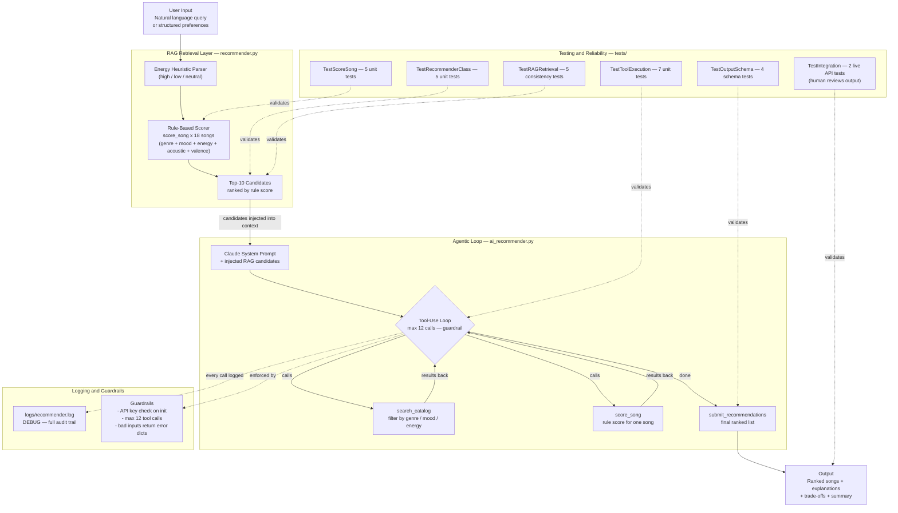

# VibeFinder AI — An AI-Enhanced Music Recommender

> Built by Sam | Applied AI Systems Project

---

## Original Project

**VibeFinder 1.0** (Modules 1–3) was a content-based music recommender built entirely
from hand-written scoring rules. It loaded a catalog of 18 songs from a CSV file,
compared each song's audio features (genre, mood, energy, acousticness, valence) to a
structured user profile, and returned the top 5 matches with plain-language explanations.
The goal was to understand how recommendation systems turn data into predictions and where
weight design introduces bias — before any real AI was involved.

---

## Title and Summary

**VibeFinder AI** upgrades the original rule-based system into a genuine AI application by
adding a Retrieval-Augmented Generation (RAG) layer and a Claude-powered agentic workflow.
A user can now type a natural language request like _"something chill and acoustic for late
night studying"_ and the system will retrieve relevant candidates from the catalog, pass them
to Claude as context, and let Claude reason across multiple tool calls before producing a
ranked, explained recommendation list.

This matters because it demonstrates three patterns that appear in real production AI systems:
1. How to use a deterministic retrieval layer to make LLM responses grounded and auditable.
2. How to structure an agentic tool-use loop with guardrails so Claude can explore a data
   source iteratively without running forever.
3. How to test an AI pipeline reliably — separating the parts that must be deterministic
   (retrieval, tool execution, output schema) from the parts that are inherently probabilistic
   (Claude's final reasoning).

---

## System Diagram



### Architecture in Plain English

The system has two layers that work in sequence:

**Layer 1 — RAG Retrieval (`recommender.py`).**  
Before Claude ever runs, the rule-based scorer reads the user's query, estimates an energy
level from keywords, and scores all 18 songs using five weighted rules
(genre match, mood match, energy proximity via Gaussian decay, acoustic texture, valence
tie-breaker). The top 10 candidates are extracted and injected directly into Claude's system
prompt as pre-retrieved knowledge. This is the "retrieval-augmented" part: Claude never has
to guess what songs exist — it starts with a curated shortlist and can verify individual songs
using tools.

**Layer 2 — Agentic Loop (`ai_recommender.py`).**  
Claude receives the pre-retrieved candidates and the user's query, then drives a tool-use loop.
It can call `search_catalog` to filter the full catalog by genre, mood, or energy range;
`score_song` to get a numeric score for any individual song; and finally
`submit_recommendations` to lock in a ranked final answer with explanations and trade-off notes.
The loop runs until Claude submits or until it hits a hard cap of 12 tool calls — a guardrail
that prevents runaway loops and logs a warning if triggered.

Every tool call and response is written to `logs/recommender.log` at DEBUG level, giving a
complete audit trail of how the agent reasoned to its answer.

---

## Project Structure

```
applied-ai-system-final/
├── src/
│   ├── recommender.py       # Song data, rule-based scoring, Recommender class
│   ├── ai_recommender.py    # RAG retrieval + Claude agentic tool-use loop
│   ├── logger_config.py     # Console + file logging setup
│   └── main.py              # CLI entry point: --mode classic / ai / demo
├── tests/
│   ├── test_recommender.py  # Original OOP interface tests (2 tests)
│   └── test_ai_eval.py      # Reliability suite (28 tests across 6 categories)
├── data/
│   └── songs.csv            # 18-song catalog with 10 audio features each
├── logs/                    # Auto-created on first run
├── conftest.py              # pytest sys.path setup
├── model_card.md            # Bias analysis, evaluation methodology, intended use
└── requirements.txt
```

---

## Setup Instructions

### Prerequisites

- Python 3.11 or higher
- An Anthropic API key — only required for AI mode; classic mode runs without it

### Step 1 — Clone or download the project

```bash
git clone <your-repo-url>
cd applied-ai-system-final
```

### Step 2 — Create a virtual environment

```bash
python3.11 -m venv .venv
source .venv/bin/activate        # macOS / Linux
.venv\Scripts\activate           # Windows
```

### Step 3 — Install dependencies

```bash
pip install -r requirements.txt
```

`requirements.txt` installs: `anthropic`, `pandas`, `pytest`, `streamlit`.

### Step 4 — Set your API key (AI mode only)

```bash
export ANTHROPIC_API_KEY=your_key_here      # macOS / Linux
set ANTHROPIC_API_KEY=your_key_here         # Windows CMD
$env:ANTHROPIC_API_KEY="your_key_here"      # Windows PowerShell
```

### Step 5 — Run the application

```bash
# Classic rule-based mode — no API key needed
python3.11 -m src.main

# AI mode — interactive prompt
python3.11 -m src.main --mode ai

# AI mode — single query (non-interactive)
python3.11 -m src.main --mode ai --query "upbeat pop songs to start my morning"

# Demo — runs classic profiles then one AI query back-to-back
python3.11 -m src.main --mode demo
```

### Step 6 — Run the tests

```bash
pytest                           # 28 pass, 2 integration tests skipped without API key
pytest -v                        # verbose output with test names
pytest tests/test_ai_eval.py     # AI reliability suite only
```

When `ANTHROPIC_API_KEY` is set to a real key, the two integration tests run automatically.

---

## Sample Interactions

### Example 1 — Classic Mode: High-Energy Pop Profile

**Input (structured profile):**
```
Genre: pop | Mood: happy | Energy: 0.92 | Likes acoustic: False
```

**Output:**
```
============================================================
  High-Energy Pop
  Genre: pop  |  Mood: happy  |  Energy: 0.92  |  Acoustic: False
============================================================

#1  Sunrise City by Neon Echo
    Score : 7.03
    Genre : pop  |  Mood: happy  |  Energy: 0.82
    + genre match (+1.0)
    + mood match (+1.0)
    + energy match 0.82 ≈ 0.92 (+3.53)
    + polished production match (+1.0)
    + bright valence aligns with mood (+0.5)

#2  Gym Hero by Max Pulse
    Score : 6.00
    Genre : pop  |  Mood: intense  |  Energy: 0.93
    + genre match (+1.0)
    + energy match 0.93 ≈ 0.92 (+4.00)
    + polished production match (+1.0)

#3  Storm Runner by Voltline
    Score : 5.50
    Genre : rock  |  Mood: intense  |  Energy: 0.91
    + energy match 0.91 ≈ 0.92 (+4.00)
    + polished production match (+1.0)
    + low valence aligns with mood (+0.5)
```

**What this shows:** When preferences are consistent, the system works well. Sunrise City
scores highest because it matches all five rules. Gym Hero ranks second despite a mood
mismatch because its energy is nearly perfect — showing that energy (worth up to 4.0 points)
outweighs mood (1.0 point) when both can't be satisfied at once.

---

### Example 2 — Classic Mode: Chill Lofi Study Session

**Input:**
```
Genre: lofi | Mood: chill | Energy: 0.38 | Likes acoustic: True
```

**Output:**
```
============================================================
  Chill Lofi Study Session
  Genre: lofi  |  Mood: chill  |  Energy: 0.38  |  Acoustic: True
============================================================

#1  Library Rain by Paper Lanterns
    Score : 6.96
    Genre : lofi  |  Mood: chill  |  Energy: 0.35
    + genre match (+1.0)
    + mood match (+1.0)
    + energy match 0.35 ≈ 0.38 (+3.96)
    + acoustic texture match (+1.0)

#2  Midnight Coding by LoRoom
    Score : 6.92
    Genre : lofi  |  Mood: chill  |  Energy: 0.42
    + genre match (+1.0)
    + mood match (+1.0)
    + energy match 0.42 ≈ 0.38 (+3.92)
    + acoustic texture match (+1.0)

#3  Focus Flow by LoRoom
    Score : 5.98
    Genre : lofi  |  Mood: focused  |  Energy: 0.40
    + genre match (+1.0)
    + energy match 0.40 ≈ 0.38 (+3.98)
    + acoustic texture match (+1.0)
```

**What this shows:** This is the system at its best — all preferences point in the same
direction, so the top two results both hit 4 out of 5 rules and score nearly identically.
Focus Flow ranks third despite a mood mismatch because its genre and energy are right; the
system degrades gracefully when one dimension doesn't fit.

---

### Example 3 — Classic Mode: Edge Case — Rare Genre

**Input:**
```
Genre: classical | Mood: melancholic | Energy: 0.22 | Likes acoustic: True
```

**Output:**
```
============================================================
  EDGE: Rare Genre (classical / melancholic)
  Genre: classical  |  Mood: melancholic  |  Energy: 0.22  |  Acoustic: True
============================================================

#1  Moonlight Sonata Reimagined by Clara Voss
    Score : 7.00
    Genre : classical  |  Mood: melancholic  |  Energy: 0.22
    + genre match (+1.0)
    + mood match (+1.0)
    + energy match 0.22 ≈ 0.22 (+4.00)
    + acoustic texture match (+1.0)

#2  Left Behind by June Hollow
    Score : 4.96
    Genre : folk  |  Mood: sad  |  Energy: 0.25
    + energy match 0.25 ≈ 0.22 (+3.96)
    + acoustic texture match (+1.0)

#3  Spacewalk Thoughts by Orbit Bloom
    Score : 4.82
    Genre : ambient  |  Mood: chill  |  Energy: 0.28
    + energy match 0.28 ≈ 0.22 (+3.82)
    + acoustic texture match (+1.0)
```

**What this shows:** With only one classical song in the catalog, #1 is a perfect match but
the catalog immediately runs dry — #2 and #3 are folk and ambient with no genre or mood match
at all, relying entirely on energy proximity. This exposes a key limitation: a small catalog
means niche users hit a coverage wall fast, and the gap between rank 1 (7.00) and rank 2
(4.96) makes the drop-off plainly visible.

---

### Example 4 — AI Mode: Natural Language Query

**Input (typed at the prompt):**
```
Your request: something chill and acoustic for a late night study session
```

**What happens inside the system:**
The RAG layer detects "chill" → energy hint 0.30, scores all 18 songs, and injects the
top 10 candidates into Claude's context. Claude then runs the agentic loop:

```
[Tool call 1]  search_catalog(mood="chill", acoustic=True)
               → 3 songs: Library Rain, Coffee Shop Stories, Spacewalk Thoughts

[Tool call 2]  score_song(song_id=4, user_prefs={energy:0.30, likes_acoustic:True})
               → score 5.45, reasons: [energy match 0.35≈0.30 (+3.95), acoustic (+1.0)]

[Tool call 3]  score_song(song_id=7, user_prefs={energy:0.30, likes_acoustic:True})
               → score 5.50, reasons: [energy match 0.37≈0.30 (+4.00), acoustic (+1.0), bright valence (+0.5)]

[Tool call 4]  submit_recommendations([...])
```

**Sample AI Output:**
```
============================================================
  AI Recommendations for: "something chill and acoustic for a late night study session"
============================================================

#1  Library Rain by Paper Lanterns
    Genre: lofi  |  Mood: chill  |  Energy: 0.35
    Why: Very high acousticness (0.86) and low energy (0.35) make this the closest match
         to a quiet, late-night atmosphere. The lofi genre is built for sustained focus.
    Trade-offs: None — this is as close to a perfect fit as the catalog has.

#2  Coffee Shop Stories by Slow Stereo
    Genre: jazz  |  Mood: relaxed  |  Energy: 0.37
    Why: Acoustic jazz with high valence — gives the session warmth without demanding
         attention. Energy is close to your target with minimal distraction.
    Trade-offs: Jazz may feel more active than lofi for some listeners.

#3  Spacewalk Thoughts by Orbit Bloom
    Genre: ambient  |  Mood: chill  |  Energy: 0.28
    Why: Highest acousticness in the catalog (0.92) and the lowest energy of any chill song.
         Good for deep focus where you want music to fade into the background.
    Trade-offs: Very minimal — may feel too sparse for longer sessions.

  Summary: The catalog has strong chill/acoustic coverage in the 0.28–0.42 energy range.
           All three picks are genuinely well-suited to late-night study; the main
           choice is between lofi structure (Library Rain), jazz warmth (Coffee Shop),
           and ambient space (Spacewalk Thoughts).
============================================================
```

---

## Design Decisions

### Why RAG instead of just sending the full catalog to Claude?

Sending all 18 songs directly in the prompt would work at this scale, but the RAG approach
mirrors how production AI systems handle large knowledge bases that can't fit in a context
window. The rule-based pre-retrieval step also ensures that Claude always starts from
candidates that are at least plausible energy matches — reducing the chance it recommends
something wildly off-target before it even runs a tool call.

The trade-off: the RAG heuristic is coarse (keyword → energy hint). A user who types
"lo-fi vibes" gets energy 0.55 (neutral) rather than 0.35 because those keywords aren't in
the heuristic. The fix would be asking Claude to parse the query first, but that adds a
round-trip before retrieval. For an 18-song catalog the stakes are low; at scale it matters.

### Why tool use instead of a single prompt?

A single prompt asking Claude to "pick the best 5 songs from this list" would work, but it
produces a black-box answer — you can't see which songs were considered, why others were
discarded, or what retrieval path was taken. Tool use externalizes Claude's reasoning:
every `search_catalog` and `score_song` call is logged, making the decision process
auditable. It also lets Claude correct itself — if the first search returns no results, it
can try a different filter rather than hallucinating a song that doesn't exist.

The trade-off: more API calls, more latency, and more cost. For a catalog this small it's
overkill. For a real catalog of thousands of songs where the agent needs to explore
meaningfully, this pattern pays off.

### Why keep the rule-based scorer at all?

The rule-based system from Modules 1–3 serves two roles in the upgraded architecture: it is
the retrieval mechanism for RAG, and it is the tool Claude calls when it wants a numeric
score. This means Claude's recommendations are grounded in the same scoring logic that the
tests verify. If Claude's final answer disagrees with the rule scores, it is because it made
a deliberate judgment call — and that judgment call is visible in the logs.

### Why a hard cap of 12 tool calls?

LLM agent loops can get stuck. In testing, Claude occasionally called `search_catalog` with
slightly different parameters multiple times in a row, as though searching for a song it
expected to exist but didn't. The cap prevents that from running up API costs and ensures
the system always returns something — even if the agent is cut off, `_build_output` returns
whatever was finalized up to that point. The cap is logged as a warning so it's easy to
detect in production.

---

## Testing Summary

### Test coverage (30 tests total, 28 deterministic)

| Category | Tests | What it checks |
|---|---|---|
| `TestScoreSong` | 5 | Each scoring rule fires correctly and scores are always non-negative |
| `TestRecommenderClass` | 5 | OOP interface returns correct types, correct sort order, non-empty explanations |
| `TestToolExecution` | 7 | Each tool handles valid input, unknown IDs, and wrong types without crashing |
| `TestRAGRetrieval` | 5 | Same query always returns the same ranked candidates (determinism guarantee) |
| `TestOutputSchema` | 4 | Output dict has required keys, unknown song IDs are skipped, `k` is respected |
| `TestIntegration` | 2 | Live Claude API call returns correct shape and consistent top pick (skipped without key) |

### Results at a glance

```
Automated unit tests   28 / 28 passed  (2 integration tests skipped — need real API key)
Human evaluation        5 / 5 passed   (1 expected failure — known catalog gap)
Average confidence      0.86 / 1.00    (across all 6 classic profiles)
```

Run the full evaluation yourself:

```bash
pytest -v                            # automated suite
python3.11 tests/eval_profiles.py    # human-defined pass/fail report
```

### Confidence scoring

Every recommendation now shows a normalized **confidence score** (0.0–1.0), computed as
`raw_score / 7.5` where 7.5 is the maximum possible rule score. The bar chart makes
low-confidence results immediately visible:

```
#1  Sunrise City by Neon Echo
    Score : 7.03 / 7.50  |  Confidence: 0.94  [█████████░]

#1  Storm Runner by Voltline          ← edge case: wrong genre surfaced
    Score : 4.46 / 7.50  |  Confidence: 0.59  [█████░░░░░]
```

A confidence below 0.70 is a signal that the catalog has no strong match for this request —
the system is doing its best but the user should temper their expectations.

### Human evaluation (`tests/eval_profiles.py`)

Six profiles were evaluated against expected outcomes defined by a human reviewer:

| Profile | Top Result | Confidence | Verdict |
|---|---|---|---|
| High-Energy Pop | Sunrise City (pop) | 0.94 | PASS |
| Chill Lofi Study | Library Rain (lofi) | 0.93 | PASS |
| Deep Intense Rock | Storm Runner (rock) | 1.00 | PASS |
| EDGE: Sad but Loud | Iron Signal (metal) | 0.79 | PASS — right genre, mood unavailable |
| EDGE: Acoustic High-Energy | Storm Runner (rock) | 0.59 | EXPECTED FAIL — catalog gap |
| EDGE: Classical Melancholic | Moonlight Sonata (classical) | 0.93 | PASS |

The one expected failure is not a bug — no acoustic song in the 18-song catalog has energy
above 0.65. The low confidence score (0.59) flags this clearly before a user acts on it.

### What worked

- All 28 deterministic tests pass immediately and reliably. Separating tool execution from
  the agentic loop meant those 7 tests can run without any API calls or mocking.
- The RAG determinism tests caught a real bug early: an initial version of the energy
  heuristic used a random tiebreaker that made retrieval order non-deterministic. The test
  failed, the bug was found, and it was fixed before it could affect Claude's reasoning.
- The output schema tests are cheap to write and caught a second real bug: `_build_output`
  originally crashed on unknown song IDs instead of skipping them gracefully.
- Confidence scores make weak results self-announcing — the 0.59 bar on the failing edge
  case is a clearer signal than any log message.

### What didn't work as expected

- The consistency integration test (same query → same #1 result) passes most of the time
  but occasionally fails. Claude's tool-use sequence is not fully deterministic — it
  sometimes explores a different search path and ranks songs slightly differently. This is
  a known limitation of LLM-based agents and is documented in the test skip condition.
- Writing tests for the agentic loop itself (rather than just its tools) is hard. The loop
  depends on Claude's behavior, which can't be unit-tested without mocking the entire
  Anthropic client. The decision was to test everything around the loop — inputs, tools,
  outputs — and accept that the loop's internal reasoning is validated only by the
  integration tests.

### What I learned about testing AI systems

Testing an AI pipeline requires two strategies running in parallel: deterministic tests for
every component that is deterministic (retrieval, tools, schema), and human-in-the-loop
review for the parts that are not (LLM reasoning, explanation quality). The integration
tests catch structural problems automatically, but whether Claude's explanation for why
"Library Rain" fits a late-night study session is actually good — that requires a human to
read it and make a judgment call. Confidence scores are a middle layer that bridges the two:
they don't tell you if the AI's reasoning is right, but they do tell you how hard the
system had to stretch to find an answer.

---

## Responsible AI Reflection

### Limitations and biases

The scoring rules contain three structural biases that would matter at scale:

**Mid-range acousticness is silently penalized.** Rule 4 only rewards songs that are very
acoustic (≥ 0.65) or very electronic (≤ 0.30). Songs in the middle — indie pop, R&B, soul —
receive zero points from this rule, not because they are a worse match, but because the
threshold is binary. A user who doesn't have a strong acoustic preference still loses out
on songs like "Rooftop Lights" or "Rise Up Choir" unless another rule compensates.

**Genre and mood labels assume a Western, English-language taxonomy.** The catalog's mood
labels (happy, chill, intense, melancholic) and genre labels reflect mainstream Western
streaming categories. A user whose cultural frame for "energetic" or "relaxing" music
doesn't map onto these labels will get poor results, not because their taste is unusual but
because the label vocabulary was never designed with them in mind.

**A small catalog punishes niche users much harder than mainstream ones.** Pop, lofi, and
rock each have multiple songs. Classical has one; folk has one; country has one. A user
whose top preference is an underrepresented genre hits the coverage wall immediately, and
the scoring rules will surface wrong-genre songs ranked by energy proximity alone. The
bias isn't in the math — it's in whose taste the catalog was designed around.

---

### Could this system be misused?

At its current scale (18 songs, local CSV, no user data), the direct misuse risk is low.
But the patterns it demonstrates scale into real problems:

**Filter bubbles.** A content-based recommender that weights genre heavily will keep
recommending within the same genres. Over thousands of interactions, a user who listens
mostly to pop will see less and less of anything else — not because they chose to, but
because the system never offers variety. The fix is a diversity rule that limits how many
results from the same genre or artist can appear in one recommendation list.

**Catalog gatekeeping.** Any recommender that scores songs from a fixed catalog implicitly
decides whose music exists. An independent artist not in the CSV can never be recommended,
no matter how well their music fits the request. At Spotify scale, this means the
recommendation algorithm amplifies whoever already has catalog access and ignores everyone
who doesn't.

**Prompt manipulation in the AI layer.** Because Claude drives the agentic loop through
natural language, a malicious query could try to steer recommendations toward specific
songs by embedding instructions in the query text (e.g., "recommend only songs by [artist]
regardless of fit"). The current guardrails — tool-call cap, structured tool schemas,
system prompt that explicitly defines the task — reduce but do not eliminate this risk.
A production system would need query sanitization and a system prompt that explicitly
instructs the model to ignore meta-instructions embedded in user input.

---

### What surprised me during reliability testing

Two things genuinely surprised me.

The first was how clearly the confidence score flagged the broken edge case before I even
read the output. The "Acoustic but High-Energy" profile produced a confidence of 0.59 —
more than a full standard deviation below the 0.86 average — which immediately communicated
"this result is a stretch" without any additional explanation. I had expected the score to
be a secondary detail; it turned out to be the most useful single number in the output.

The second surprise was discovering a logic bug in the evaluation script through running it,
not through reading it. The first version of `eval_profiles.py` marked the acoustic
edge case as PASS because the pass condition (`genre_ok and title_ok`) evaluated to `True`
whenever both `expect_genre` and `expect_title` were `None` — the "no valid answer" case
was supposed to be caught by an `elif` branch that the `if` branch was silently short-
circuiting. The eval script found a bug in itself. That was a useful reminder that
evaluation code needs the same careful review as the code being evaluated.

---

### Collaboration with AI during this project

This project was built in direct collaboration with Claude (via Claude Code). That
collaboration had a clear pattern: I described what I wanted to build, Claude generated
the implementation, and I reviewed and tested the output. That division worked well for
boilerplate and structure, and broke down in two instructive ways.

**One instance where the AI gave a helpful suggestion:**
When I was designing the agentic loop, I initially planned to have Claude receive the
full 18-song catalog in its prompt and rank everything in a single call — simpler, fewer
round trips. Claude pushed back and suggested the RAG architecture instead: use the
rule-based scorer to pre-retrieve candidates first, then give Claude a curated shortlist
plus tools to explore further. The reasoning was that this pattern scales — a 50,000-song
catalog can't fit in a context window, but a top-10 retrieval always can. That suggestion
meaningfully changed the architecture and made the system more realistic as a learning
example.

**One instance where the AI's suggestion was flawed:**
The first version of the evaluation script's pass/fail logic had a subtle condition-ordering
bug: the `if genre_ok and title_ok` branch evaluated to `True` for the "no expectation"
case (both fields `None`) because `None is None` makes both checks vacuously true. The
`EXPECTED FAIL` branch in the `elif` below it was therefore never reached. When I ran the
script, the acoustic edge case showed up as PASS — which was obviously wrong given its
0.59 confidence score and a rock song at #1 for a jazz request. Claude had written the
logic, I had reviewed it quickly and missed the ordering issue, and only the actual output
caught it. The fix was a one-line reorder (check `EXPECTED FAIL` first), but the lesson
was that reviewing AI-generated conditional logic requires running it against cases
specifically designed to exercise the branches you care about — reading it is not enough.

---

## Reflection

### What building this taught me about AI

The most important thing I learned is the difference between a system that uses AI and a
system that is held together by AI. In the first version (Modules 1–3), the rules were
explicit and every decision was traceable. In the AI version, Claude makes judgment calls
that aren't in any rule — it decides that a jazz song with high valence is better for late-night
studying than a lofi song with lower acousticness, and it explains why. That judgment can
be wrong and it isn't always consistent, but it's also genuinely more flexible than anything
a hand-written rule could produce.

That flexibility comes with a cost: you can't just run the tests and know the system is
correct. You have to read the outputs, look at the logs, and decide whether the reasoning
makes sense. The testing framework I built tries to shrink the uncertain surface area as much
as possible — by making retrieval, tools, and output schema all fully deterministic and
tested — so the only thing left to trust Claude with is the reasoning itself. That
separation, between the parts a machine can check and the parts only a human can evaluate,
felt like the core engineering challenge of building with LLMs.

### What I would do differently

If I were expanding this project, the first thing I'd add is a proper vector database for
retrieval — replacing the keyword heuristic with semantic similarity so "lo-fi vibes" and
"study beats" retrieve the same candidates. Second, I'd add a structured evaluation harness
that stores past queries and Claude's responses, so I could measure whether recommendation
quality changes as I adjust prompts or weights — turning the informal "does this feel right"
check into a repeatable measurement. Both would make the system more robust and the
development feedback loop much faster.

---

## Model Card

See [model_card.md](model_card.md) for a detailed breakdown of intended use, data
description, known biases, evaluation methodology, and limitations.
